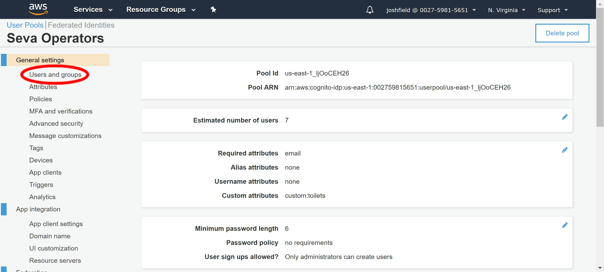
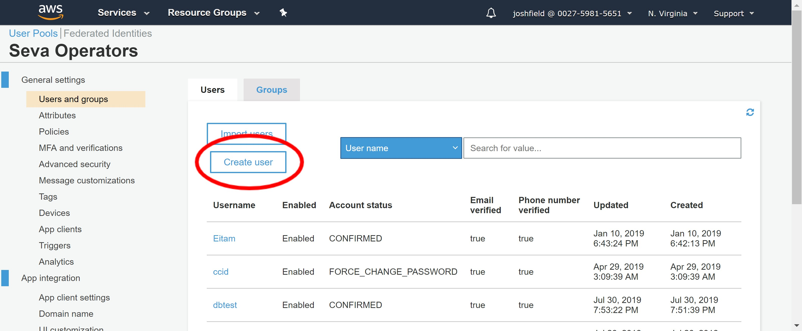
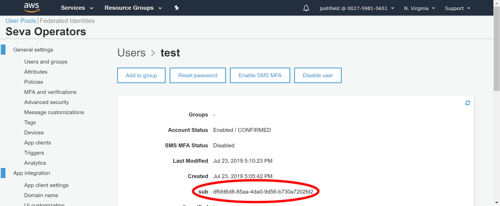
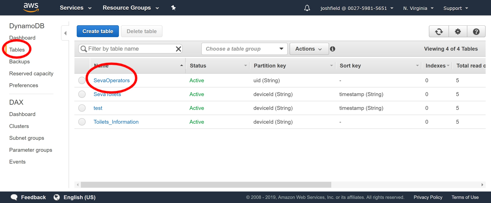
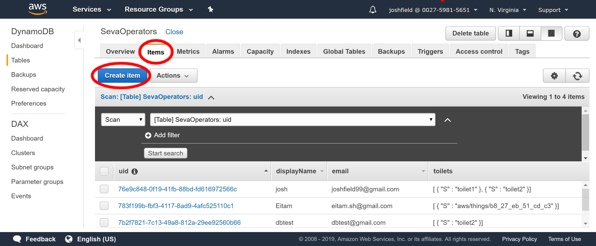

Seva App
==
This is the android App for the Caltech Seva Toilet Project.  
The goal is to connect the operators to the repair guides and other information.

Design: [Anastasia Hanan | Case Study:SEVA](https://www.anastasiahanan.com/caltechsevanp)  
Research: [Michael R. Hoffmann | Self-contained Toilet Wastewater Treatment](http://www.hoffmann.caltech.edu/research/seva.html)  

### Creating new users
Here are the steps to create new operators for the app.

#### Cognito
Cognito will allow the users to login to the app.
  
1. Log into [Amazon Cognito](https://console.aws.amazon.com/cognito/home?region=us-east-1#). And click on `Manage User Pools` and then `Seva Operators` to get to the user pool for the app.
2. Click on `Users and Groups`    


3. Click on `Create user`  


4. Fill in the Username, Temporary-password, Phone Number, and Email sections. Leave all checkmarks, and only check which method of sending the invitation to the user. (SMS and Email)
5. Hit `Create user`
6. Click on the newly created Username highlighted in blue. We will need to comeback to the `sub` key to identify the users in the database.



#### DynamoDB
DynamoDB will store more detailed information about each user, essentially their profile. The table this is information is all stored in is called ToiletOperators
  
1. Log into [DynamoDB](https://console.aws.amazon.com/dynamodb/home?region=us-east-1#).
2. Click on `Tables` and then from the list of tables choose `SevaOperators`.


3. Select `Items` from the tabs and then hit `Create item`


4. From the dropdown menu switch it from `Tree` to `Text` and enter the new user's information in the following format. Where the `uid` field is the `sub` string from Step 6 in the Cognito instructions.
```
{
  "displayName": "test",
  "email": "test@gmail.com",
  "toilets": [
    "toilet6",
    "toilet2"
  ],
  "uid": "dfbfd6d8-85aa-4da0-9d56-b730a7202fd2"
}
```
5. Click `Save` and make sure the new user shows up in the table.
#### SNS
*TBD there might be a Lambda function for this.*

### Adding repair guides
This is all done in DBBrowser. The database can either be manually edited or a csv can be imported.

1. [Download](https://sqlitebrowser.org/dl/) and open DBBrowser.
2. Open the database: `File->Open Database...` Location: `app/src/main/assets/databases/sevaDb.db`

### Adding new toilets
The information for the toilets is stored locally on the App so this will also be done in DBBrowser.  

1. Open the sevaDb just as above.
2. 


### Resources
- [[Android] Creating Custom Login Screen for AWS Mobile Hub](https://wtmimura.com/post/aws-mobile-hub-android-custom-login/)
- AWS Documentation Guides & Documentation
- Android Developers Documentation 
