# Seva App
### Background
This is the android App for the Caltech Seva Toilet Project.  
The goal is to connect the operators to the repair guides and other information.

Design: [Anastasia Hanan | Case Study:SEVA](https://www.anastasiahanan.com/caltechsevanp) and Melissa Lee  
Research: [Michael R. Hoffmann | Self-contained Toilet Wastewater Treatment](http://www.hoffmann.caltech.edu/research/seva.html)  

### Screenshots
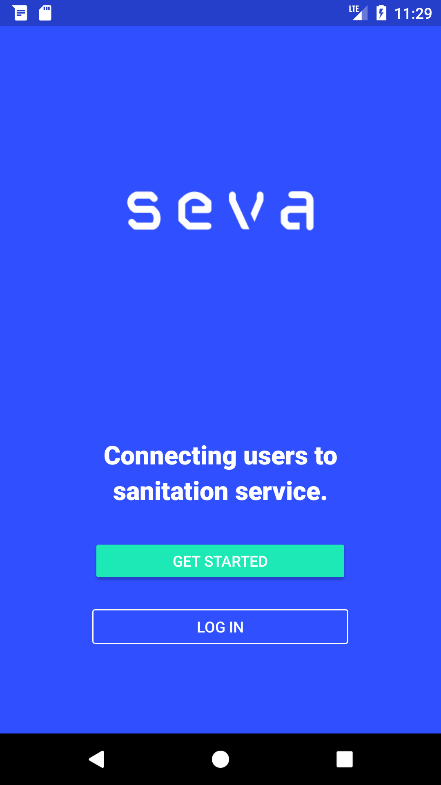&nbsp;&nbsp;&nbsp;&nbsp;
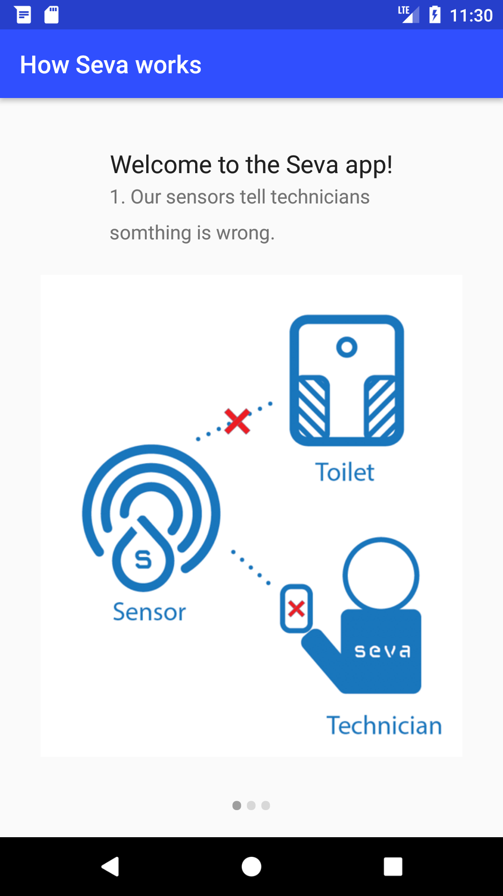&nbsp;&nbsp;&nbsp;&nbsp;
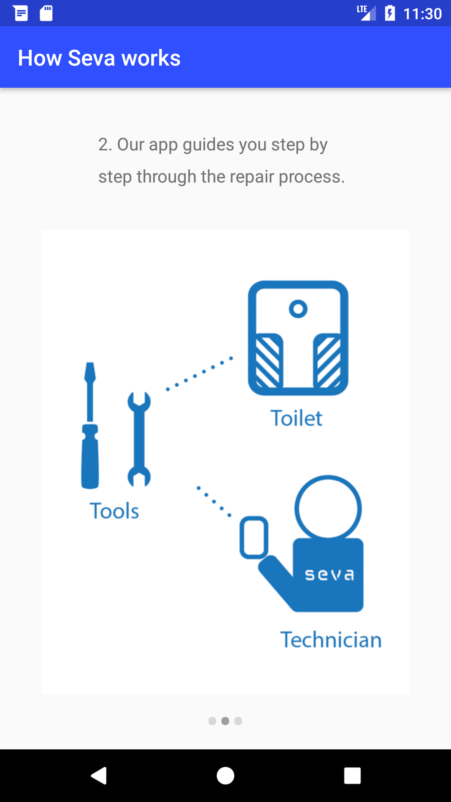
 
 
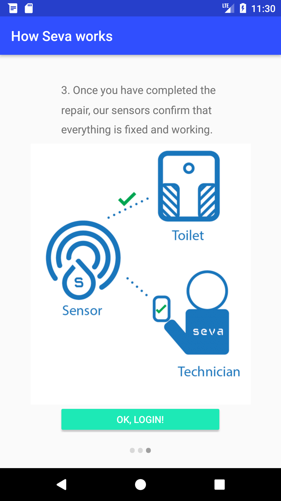&nbsp;&nbsp;&nbsp;&nbsp;
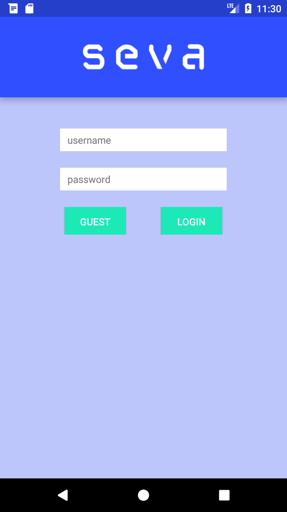&nbsp;&nbsp;&nbsp;&nbsp;
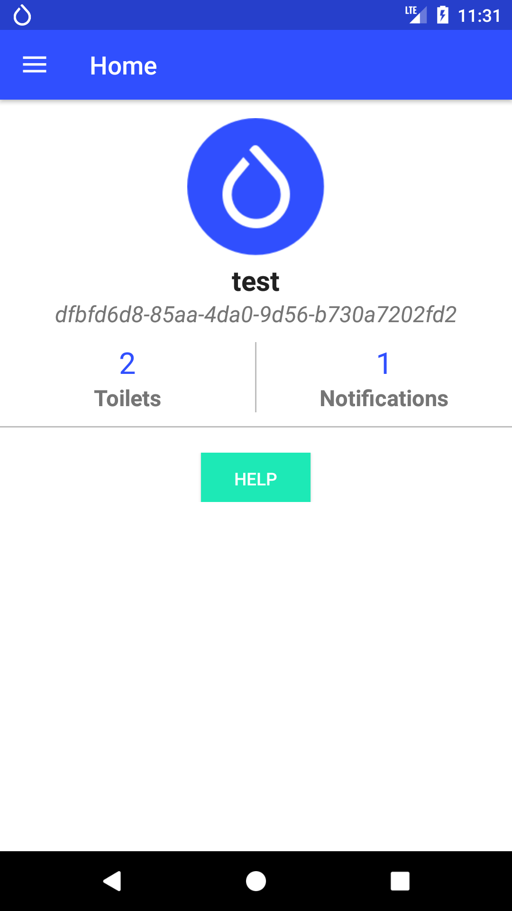
 
 
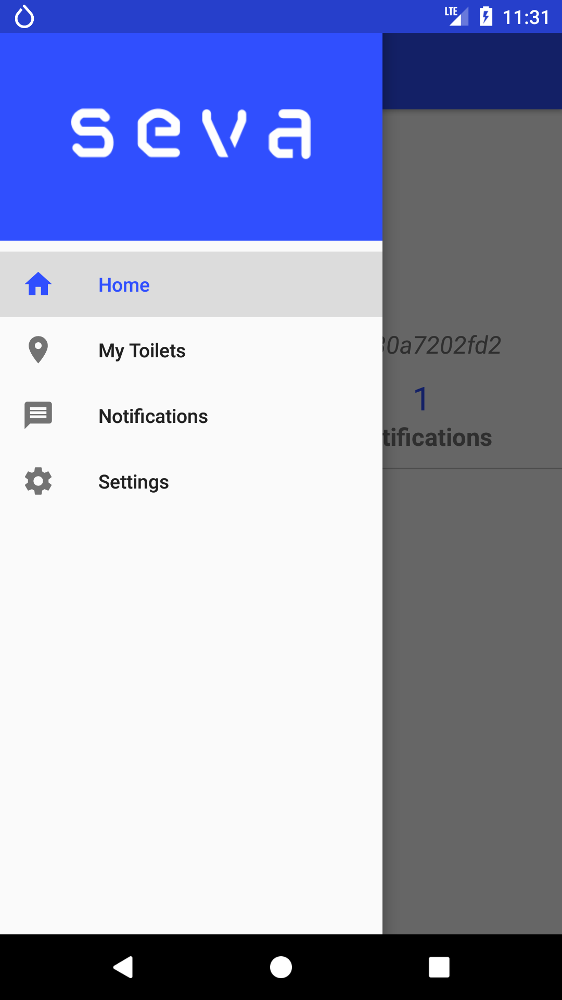&nbsp;&nbsp;&nbsp;&nbsp;
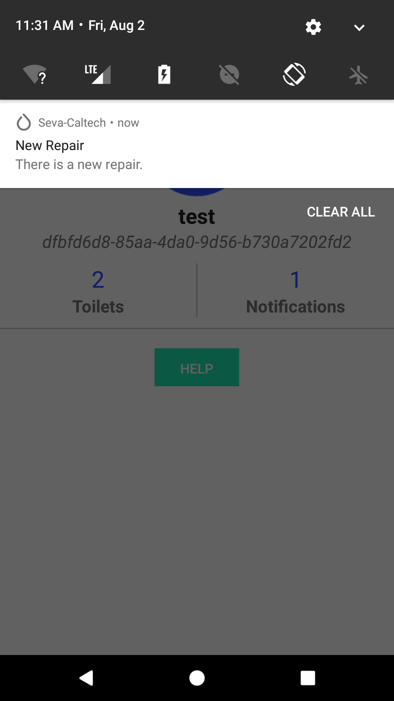&nbsp;&nbsp;&nbsp;&nbsp;
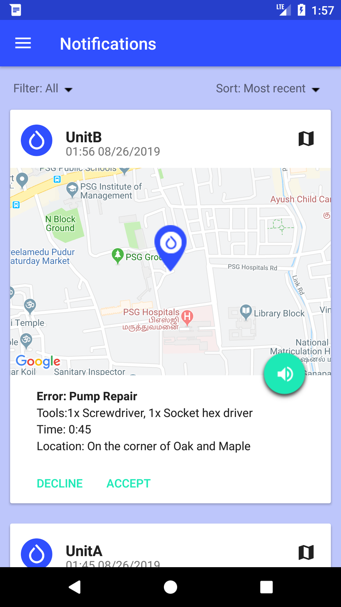
 
 
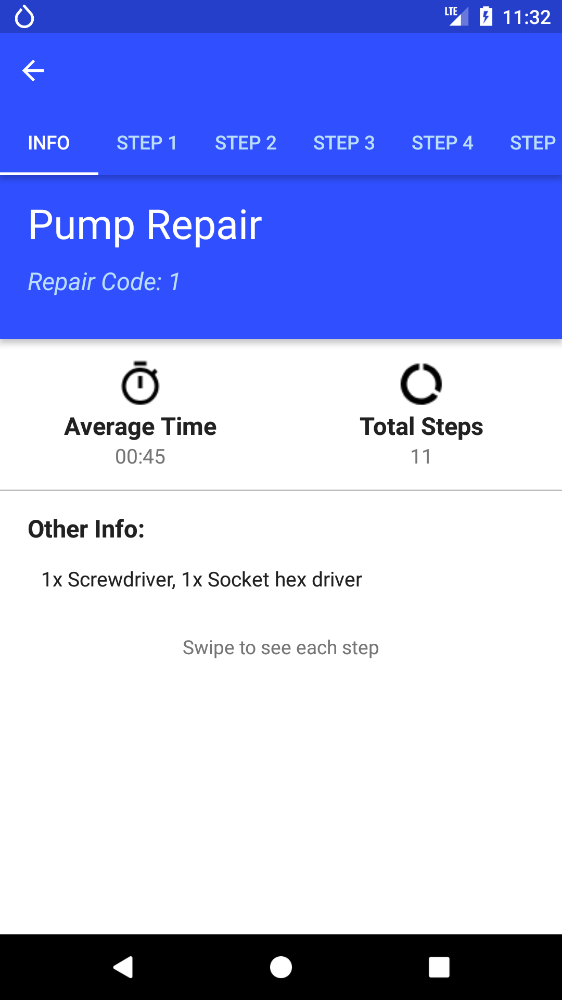&nbsp;&nbsp;&nbsp;&nbsp;
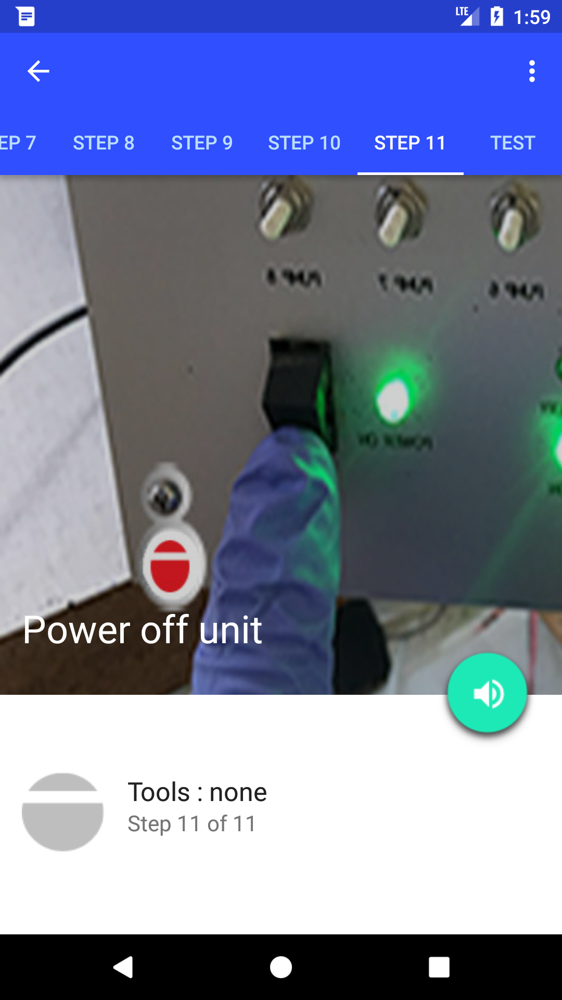&nbsp;&nbsp;&nbsp;&nbsp;
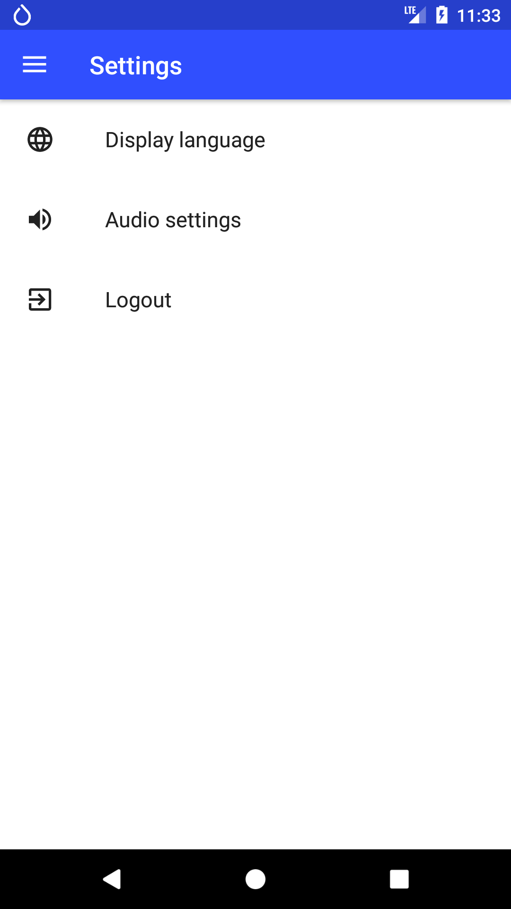
 
 
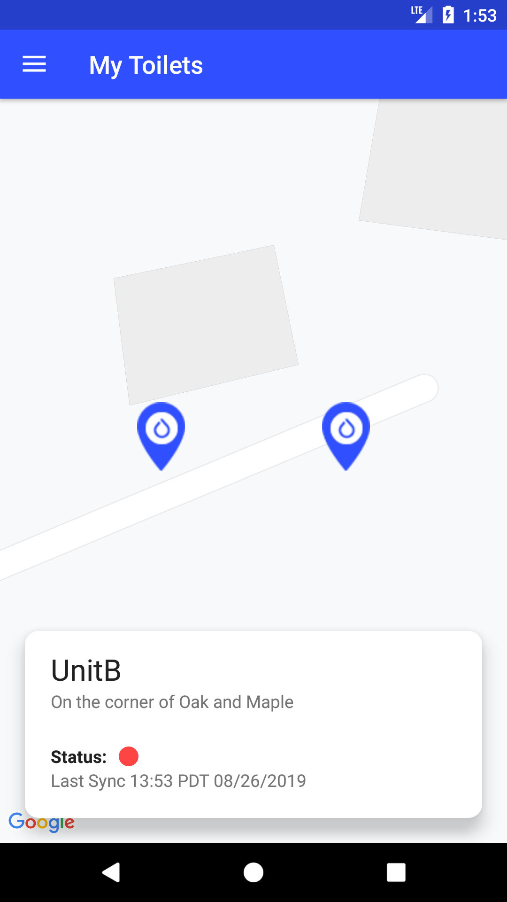&nbsp;&nbsp;&nbsp;&nbsp;
 
 
---
### Resources
- [[Android] Creating Custom Login Screen for AWS Mobile Hub](https://wtmimura.com/post/aws-mobile-hub-android-custom-login/)
- [AWS Documentation Guides & Documentation](https://docs.aws.amazon.com/aws-mobile/latest/developerguide/reference-mobile-hub.html)
- [Android Developers Documentation](https://developer.android.com/docs) 
