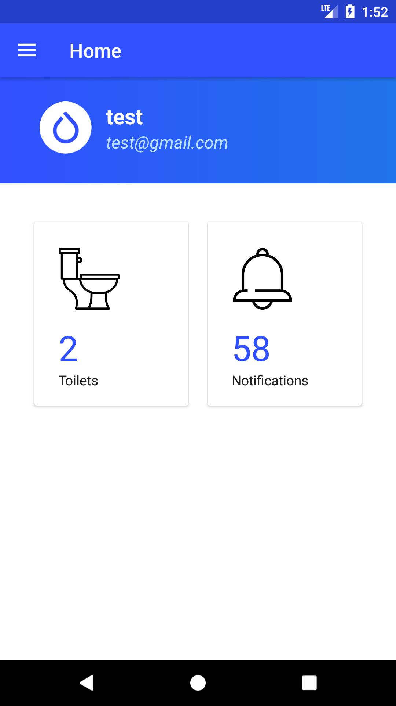
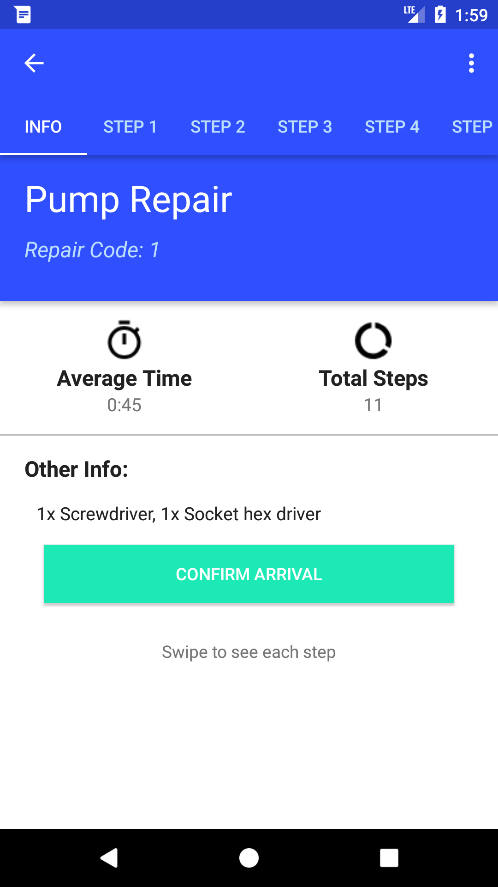
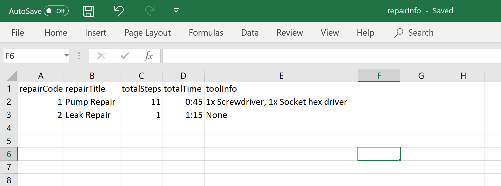
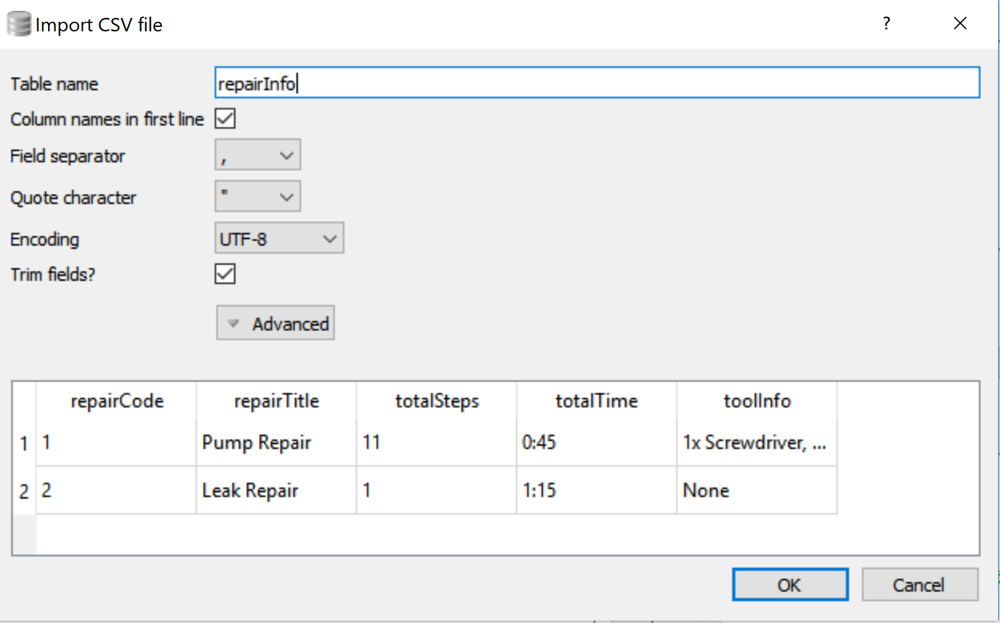
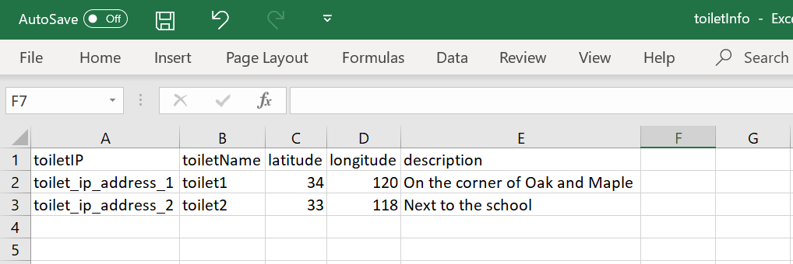

Seva App
==
### Background
This is the android App for the Caltech Seva Toilet Project.  
The goal is to connect the operators to the repair guides and other information.

Design: [Anastasia Hanan | Case Study:SEVA](https://www.anastasiahanan.com/caltechsevanp)  
Research: [Michael R. Hoffmann | Self-contained Toilet Wastewater Treatment](http://www.hoffmann.caltech.edu/research/seva.html)  

### Screenshots
&nbsp;&nbsp;&nbsp;&nbsp;
&nbsp;&nbsp;&nbsp;&nbsp;

<br>
<br>
&nbsp;&nbsp;&nbsp;&nbsp;
&nbsp;&nbsp;&nbsp;&nbsp;

<br>
<br>
&nbsp;&nbsp;&nbsp;&nbsp;
&nbsp;&nbsp;&nbsp;&nbsp;

<br>
<br>
&nbsp;&nbsp;&nbsp;&nbsp;
&nbsp;&nbsp;&nbsp;&nbsp;

<br>
<br>

---
### Creating new users
Here are the steps to create new operators for the app.

#### Cognito
Cognito will allow the users to login to the app.
  
1. Log into [Amazon Cognito](https://console.aws.amazon.com/cognito/home?region=us-east-1#). And click on `Manage User Pools` and then `Seva Operators` to get to the user pool for the app.
2. Click on `Users and Groups`    


3. Click on `Create user`  


4. Fill in the Username, Temporary-password, Phone Number, and Email sections. Leave all checkmarks, and only check which method of sending the invitation to the user. (SMS and Email)
5. Hit `Create user`
6. Click on the newly created Username highlighted in blue. We will need to comeback to the `sub` key to identify the users in the database.


#### DynamoDB
DynamoDB will store more detailed information about each user, essentially their profile. The table this is information is all stored in is called ToiletOperators
  
1. Log into [DynamoDB](https://console.aws.amazon.com/dynamodb/home?region=us-east-1#).
2. Click on `Tables` and then from the list of tables choose `SevaOperators`.


3. Select `Items` from the tabs and then hit `Create item`


4. From the dropdown menu switch it from `Tree` to `Text` and enter the new user's information in the following format. Where the `uid` field is the `sub` string from Step 6 in the Cognito instructions.
```
{
  "displayName": "test",
  "email": "test@gmail.com",
  "phone": "+15555555555"
  "toilets": [
    "toilet_ip_address_1",
    "toilet_ip_address_2"
  ],
  "uid": "dfbfd6d8-85aa-4da0-9d56-b730a7202fd2"
}
```
5. Click `Save` and make sure the new user shows up in the table.
#### SNS
AWS Simple Notification Service (SNS) handles sending error notification messages to the operators. Where users are subscribed to each toilet as a topic.  
*There might be a Lambda function to do this automatically in the future.*  

6. Log into [Amazon SNS](https://console.aws.amazon.com/sns/v3/home?region=us-east-1#/dashboard). Click `Topics`, select the toilet that the operator is in charge of, and click `Create subscription`. 
 

7. Select `SMS` from the dropdown `Protocol` menu, fill in the `Endpoint` field with the user's phone number, and hit `Create subscription`.

### Adding repair guides
This is all done in DBBrowser. The database can either be manually edited or a csv can be imported.  

1. [Download](https://sqlitebrowser.org/dl/) and open DBBrowser.
2. Open the database: `File->Open Database...` Location: `app/src/main/assets/databases/sevaDb.db`

#### repairInfo table
This table contains the extra information for each repair guide. 

3. Create the csv with the following structure and name it `repairInfo.csv`.

<br>
<br>

*NOTE: When importing a csv into DBBrowser, the csv will be appended to the selected table if it already exists. So we first want to clear the existing table*.   
4. Click on the `Execute SQL` tab. Type in the following SQL command to clear the table. Then press the play button.
```
DELETE FROM repairInfo
```


5. Import the repairInfo table: `File->Import->Table from CSV file...`. Select your `repairInfo.csv` file.
6. Verify that the format is correct. Then press `OK` and `Yes`


7. To view the repairInfo table select the `Browse Data` tab and `repairInfo` from the dropdown menu.


#### repairStep table
The repairStep table contains each step for a given repair code.

8. Create the csv with the following structure and name it `repairStep-X.csv`. **Where `X` is the number of the repair code.**
 

9. If the repairStep-X table exists already, clear it just like Step 4 above, but change the table name to the repairStep table:
```
DELETE FROM repairStep-X
```

10. Import the repairStep-X csv and verify that the table is correct, following steps 5-7 above.

### Adding new toilets
The information for the toilets is stored locally on the App so this will also be done in DBBrowser.  

1. Open the sevaDb just as Steps 1-2 above.
2. Create the csv with the following structure and name it `toiletInfo.csv`.
 

3. Clear the current toiletInfo table by following step 4 from the repair guide instructions above.
4. Import the toiletInfo csv and verify that the table is correct, following steps 5-7 above.

### Deploying App
TBD still working on this.  
1. 

---
### Resources
- [[Android] Creating Custom Login Screen for AWS Mobile Hub](https://wtmimura.com/post/aws-mobile-hub-android-custom-login/)
- [AWS Documentation Guides & Documentation](https://docs.aws.amazon.com/aws-mobile/latest/developerguide/reference-mobile-hub.html)
- [Android Developers Documentation](https://developer.android.com/docs) 
