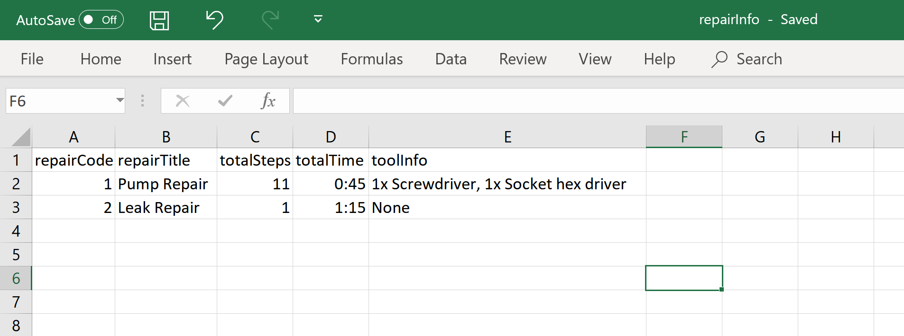
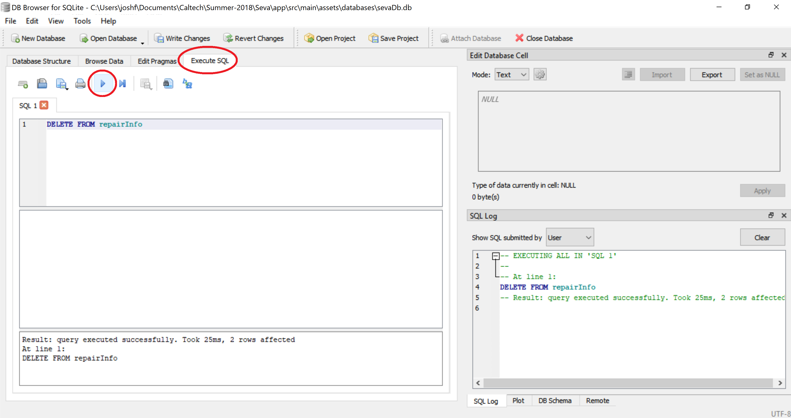
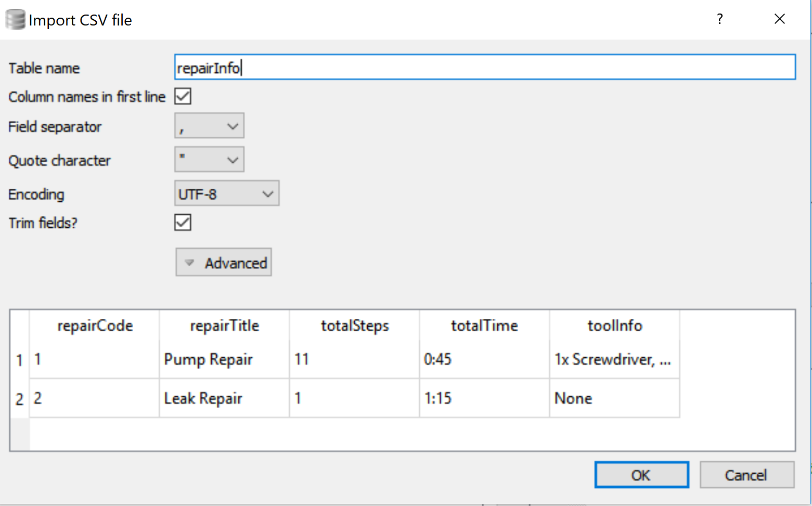
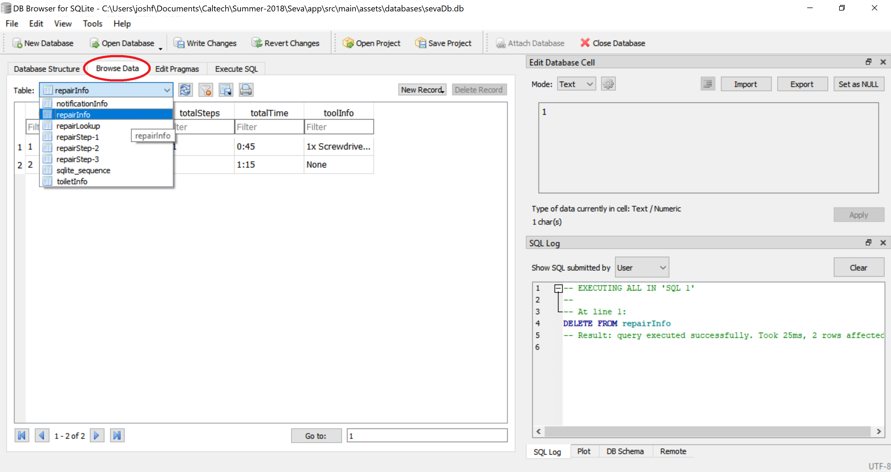
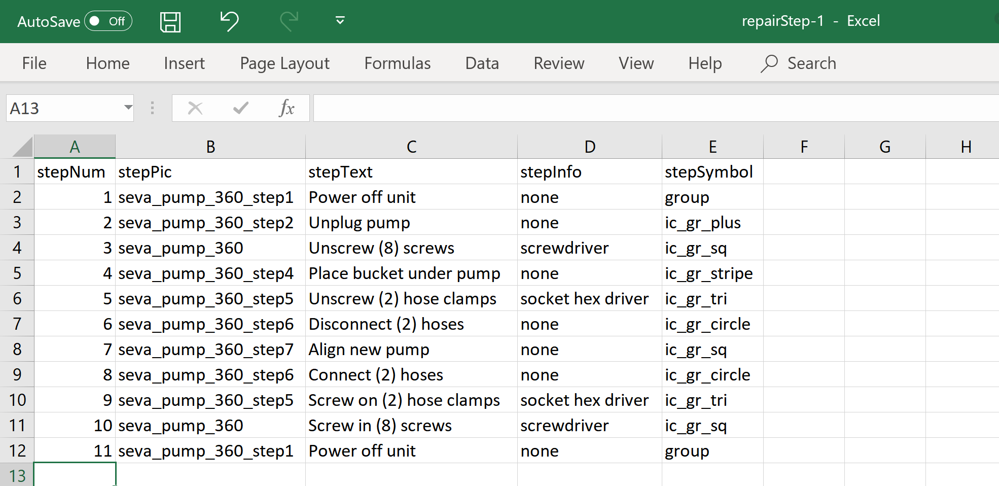

# Adding repair guides and toilets
This is all done in DBBrowser. The database can either be manually edited or a csv can be imported.  

1. [Download](https://sqlitebrowser.org/dl/) and open DBBrowser.
2. Open the database: `File->Open Database...` Location: `app/src/main/assets/databases/sevaDb.db`

#### repairInfo table
This table contains the extra information for each repair guide. 

3. Create the csv with the following structure and name it `repairInfo.csv`.

<br>
<br>

*NOTE: When importing a csv into DBBrowser, the csv will be appended to the selected table if it already exists. So we first want to clear the existing table*.   
4. Click on the `Execute SQL` tab. Type in the following SQL command to clear the table. Then press the play button.
```
DELETE FROM repairInfo
```


5. Import the repairInfo table: `File->Import->Table from CSV file...`. Select your `repairInfo.csv` file.
6. Verify that the format is correct. Then press `OK` and `Yes`


7. To view the repairInfo table select the `Browse Data` tab and `repairInfo` from the dropdown menu.


#### repairStep table
The repairStep table contains each step for a given repair code.

8. Create the csv with the following structure and name it `repairStep-X.csv`. **Where `X` is the number of the repair code.**
 

9. If the repairStep-X table exists already, clear it just like Step 4 above, but change the table name to the repairStep table:
```
DELETE FROM repairStep-X
```

10. Import the repairStep-X csv and verify that the table is correct, following steps 5-7 above.

### Adding new toilets
The information for the toilets is stored locally on the App so this will also be done in DBBrowser.  

1. Open the sevaDb just as Steps 1-2 above.
2. Create the csv with the following structure and name it `toiletInfo.csv`.
 

3. Clear the current toiletInfo table by following step 4 from the repair guide instructions above.
4. Import the toiletInfo csv and verify that the table is correct, following steps 5-7 above.
