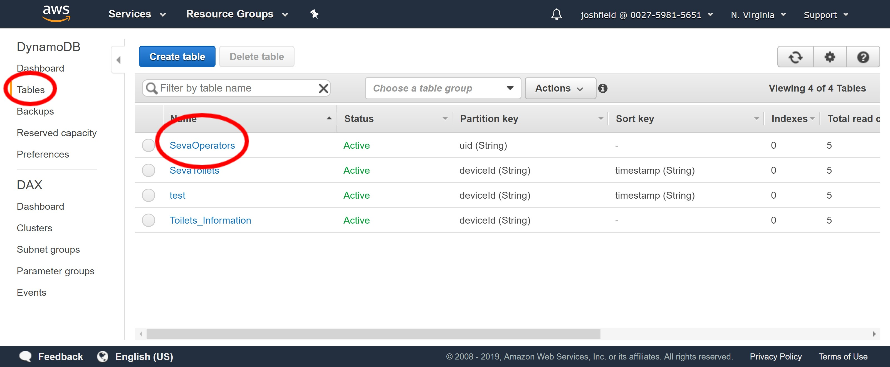

# Creating new users
*Note: this is automated in the `add_user.py` script*
Here are the steps to create new operators for the app from the AWS Management Console.

#### Cognito
Cognito will allow the users to login to the app.
  
1. Log into [Amazon Cognito](https://console.aws.amazon.com/cognito/home?region=us-east-1#). And click on `Manage User Pools` and then `Seva Operators` to get to the user pool for the app.
2. Click on `Users and Groups`    


3. Click on `Create user`  


4. Fill in the Username, Temporary-password, Phone Number, and Email sections. Leave all checkmarks, and only check which method of sending the invitation to the user. (SMS and Email)
5. Hit `Create user`
6. Click on the newly created Username highlighted in blue. We will need to comeback to the `sub` key to identify the users in the database.


#### DynamoDB
DynamoDB will store more detailed information about each user, essentially their profile. The table this is information is all stored in is called ToiletOperators
  
1. Log into [DynamoDB](https://console.aws.amazon.com/dynamodb/home?region=us-east-1#).
2. Click on `Tables` and then from the list of tables choose `SevaOperators`.


3. Select `Items` from the tabs and then hit `Create item`


4. From the dropdown menu switch it from `Tree` to `Text` and enter the new user's information in the following format. Where the `uid` field is the `sub` string from Step 6 in the Cognito instructions.
```
{
  "displayName": "test",
  "email": "test@gmail.com",
  "phone": "+15555555555"
  "toilets": [
    "toilet_ip_address_1",
    "toilet_ip_address_2"
  ],
  "uid": "dfbfd6d8-85aa-4da0-9d56-b730a7202fd2"
}
```
5. Click `Save` and make sure the new user shows up in the table.
#### SNS
AWS Simple Notification Service (SNS) handles sending error notification messages to the operators. Where users are subscribed to each toilet as a topic.  
*There might be a Lambda function to do this automatically in the future.*  

6. Log into [Amazon SNS](https://console.aws.amazon.com/sns/v3/home?region=us-east-1#/dashboard). Click `Topics`, select the toilet that the operator is in charge of, and click `Create subscription`. 
 

7. Select `SMS` from the dropdown `Protocol` menu, fill in the `Endpoint` field with the user's phone number, and hit `Create subscription`.
